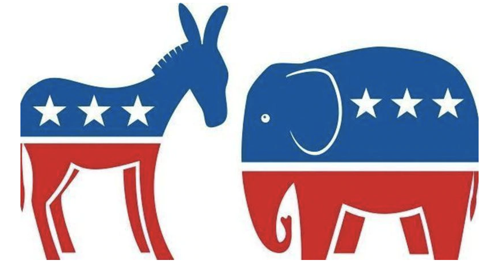
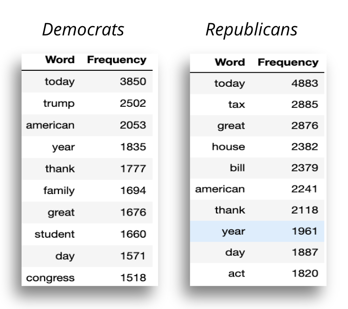
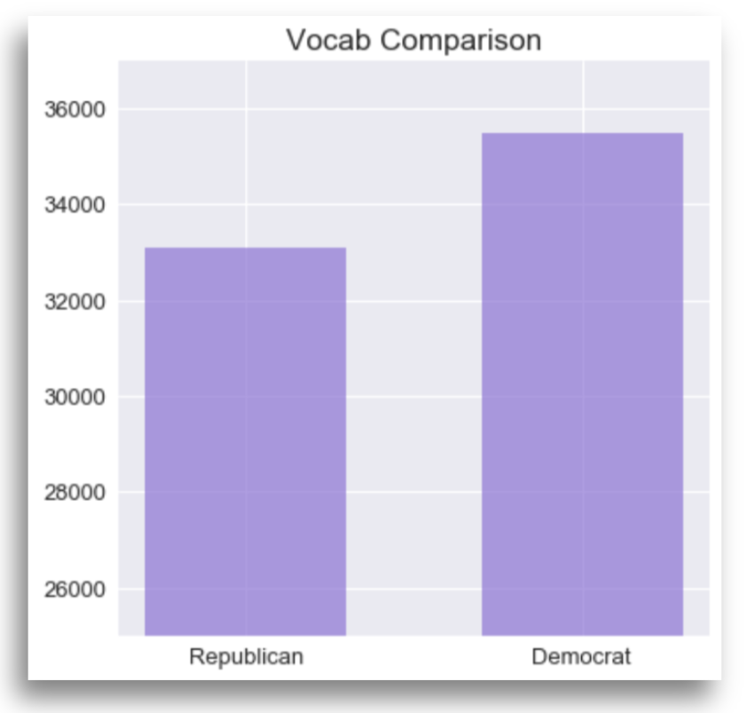
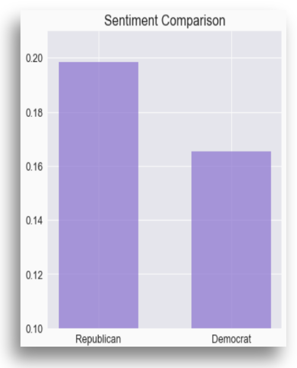
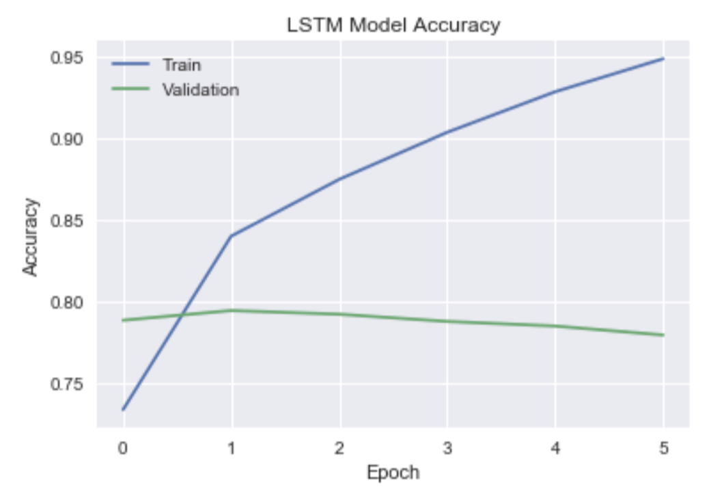

Note: The following README outlines a project conducted by the fictitious consulting firm, JE Consulting (me), for a fictitious political consulting firm, Trace Political. This hypothetical scenario was used to establish a narrative around the project's intent and purpose. The accompanying jupyter notebook contained within the repository walks the viewer through the steps used to complete the project along with explanations of the code and methodology behind each step. 

The project included the following highlights which can be viewed in detail within the accompanying 'Party_Tweets' notebook:

- Natural Language Processing with NLTK
- Sentiment analysis with TextBlob
- ANN modeling using LSTM and GRU networks

Below is a summary of the project's intent and findings.

***

# Party Tweets

     

## Project Overview

The intent for this project was two-fold: 

**Part One** 

Part one focused on analyzing a dataset containing ~86K tweets from both Republicans and Democrats who were at the time the tweets were published sitting members of the house of representatives. In part one, I analyze the text corpus from both parties' tweets for a side by side comparison. The following is a list of insights Trace Political tasked JE Consulting with extracting from the initial corpus analysis: 

- The 10 most common words used within tweets from both Democrat and Republican representatives
- The total vocab count for both the Democrat and Republican tweet corpus'
- Words with the highest semantic relation to the following via the word vectorization: 
    - Trump
    - Bill
    - Tax
- Extract the sentiment rating from the Democrat and Republican tweet corpus

**Part Two**

In addition to corpus analysis, Trace Political tasked JE Consulting with assessing the feasibility of building a classifier using neural networks that successfully predicts the political party of which the author of an official tweet belongs. To be deemed successful, the model must predict political party with 90% accuracy on test data. Should this succeed, Trace Political will further pursue projects related to predictive modeling with natural language processing for use among it's consulting operations.

***

## The Data

The data used for this project comes from Kaggle and includes a sampling of ~86k tweets sent from both Democratic and Republican representatives in the U.S. Congress during May 2018. 

The dataset can be found via the following link: https://www.kaggle.com/kapastor/democratvsrepublicantweets

***

## Part One Results

Below I walk through the findings for each section in part one. Each section was an insight Trace Political tasked JE Consulting with extracting from the provided dataset.

**Number of Tweets By Party**

To begin, I looked at the total number of tweets from each party contained in the dataset:
- Number of Democrat tweets: 42,068
- Number of Republican tweets: 44,392

     

**Common Words by Party**

I then analyzed the most common words used on twitter by each party. The tables below list the most common words sorted by frequency. Interestingly, 'Today' is the most common word for each party followed by 'Trump' and 'American' for Democrats and 'Tax' and 'Great' for Republicans:

     

**Vocab Length**

Next, I looked at the unique vocab count by party. Perhaps not surprisingly, both parties exhibited a similar vocab count within their twitter lexicons. For this particular dataset, Democrats used slightly more words than Republicans: 

     

**Semantic Relationships**

Trace Political then tasked JE Consulting with extracting the 10 words with the closest semantic relationship to a list of keywords for both parties. The keywords were 'Trump', 'Bill', and 'Tax'. 

I've included below the words with the closest semantic relationship to 'Tax' for both parties. The relationships to 'Trump' and 'Bill' can be found in the accompanying notebook: 

     

**Sentiment Analysis**

The final step in the corpus analysis looked at the overall sentiment score from both parties:

     

The party in power (which at the time these tweets were published was the Republican party) exhibited a higher sentiment score as their published tweets likely took a positive tone in support of current congressional political initiatives. Conversely, the party not in power (Democrats) likely spoke in a more negative tone as they looked to diminish the achievements and legislative agenda of the current majority party.

***

## Part Two

**Modeling**

In part two, I experimented with several deep learning models in an attempt to extract the best model (LSTM, GRU), model architecture, and hyperparameters. In all cases, and given the dataset available, each model exhibited clear signs of overfitting on the training set. The model with the best performance produced an accuracy score of ~78% on the testing set, far below our target of 90%. 

The below image depicts the training vs. validation accuracy score for each epoch during and example of model training. The divergence in accuracy scores indicates clear overfitting on the training data: 

     

Multiple attempts were made to improve these model performances to no avail. The extent of the model experimentation can be found in the accompanying jupyter notebook. 

***

## Conclusions

Based on the objectives set forth by Trace Political, JE Consulting failed to produce a model that can predict party affiliation with a 90% accuracy score. Further, each model exhibited clear signs of overfitting which does not lend itself to any successful real-world production deployment. The short answer as to why our models failed to meet the model accuracy threshold is likely the result of insufficient data for model training. 

**Recommendations**

The models produced exhibit clear overfitting on the training data. Further, the predictive power of each model downright abysmal to somewhat applicable. To combat this, JE Consulting recommends Trace Political acquire further tweet data from which our models can train. 

Additionally, Trace Political should look to data sources beyond twitter. Perhaps other forms of social media, or press releases, would provide rich text data that can be used to further train our models.  

**Future Work**

Furthur work is needed to continue refining and tuning both the hyperparameters of these models as well as the overall model architectures.

Additionally, work could be done on different practices used for cleaning the text data. It's likely there is predictive information stored within some of the symbols and special characters commonly used within tweets. For this project, all special characters and punctuation were removed from the text data.

Finally, work should be done to develop a relevant use case for a model that accurately predicts the political party by tweet content. Though we did not meet Trace Political's threshold for deeming the models a success, more data, data cleaning experimentation, and model iterations could feasibly produce a successful model. Should we succeed in producing a viable model, use cases for employing the model should be flushed out for use within Trace Political's product offering. The decision to continue work on improving the accuracy score is one that Trace Political will need to make after a thorough cost-benefit analysis. 
