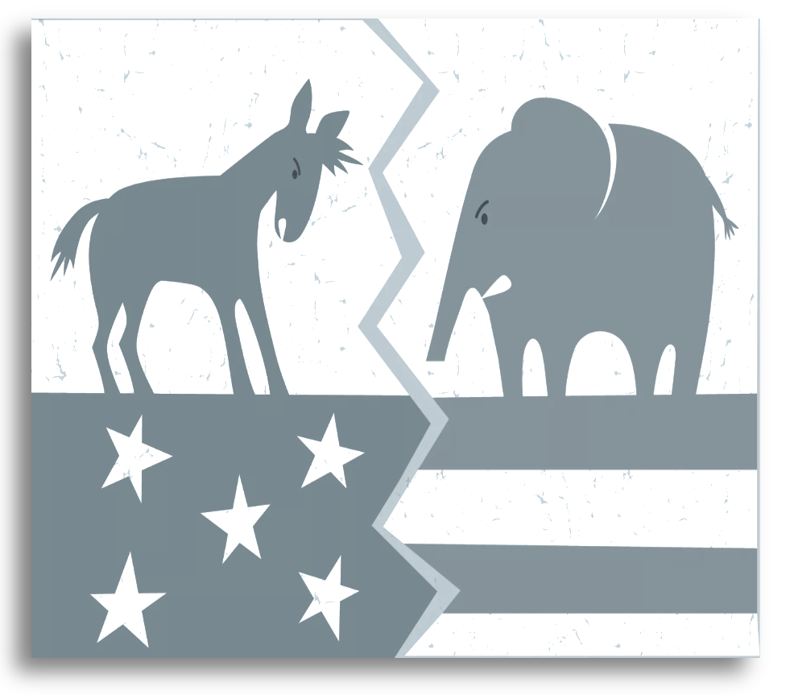
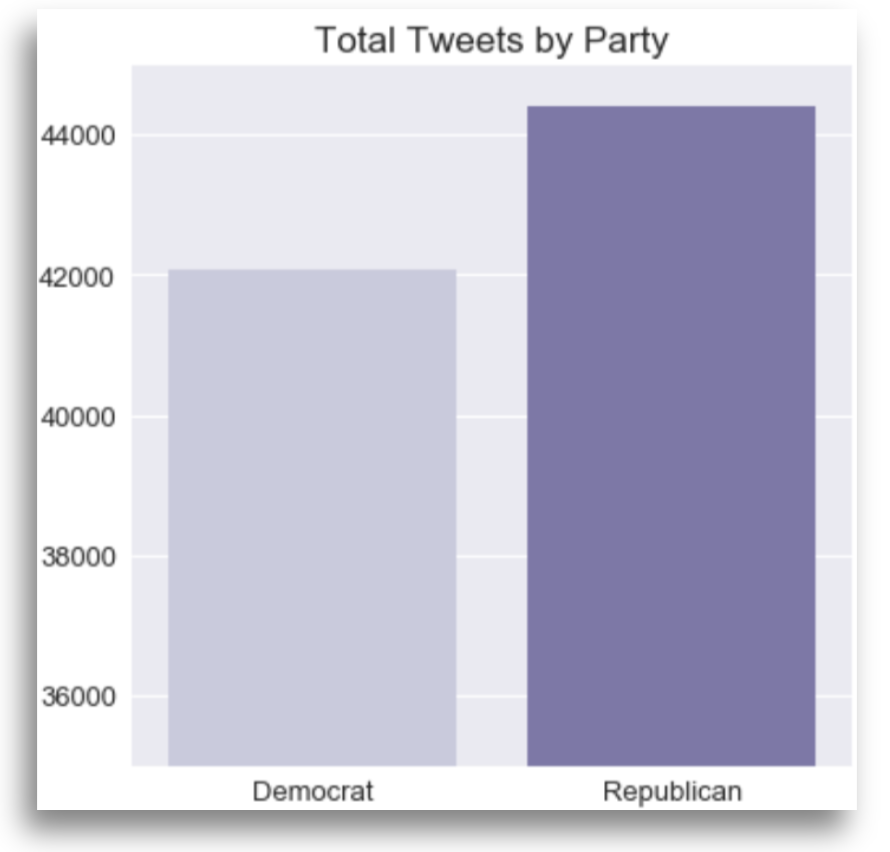

The following outlines a project conducted by the fictictous consulting firm, JE Consulting (me), for a fictictious political consulting firm, Trace Political. This hypothetical scenario was established to conduct a narrative around the project's intent and purpose. 

The accompanying jupyter notebook contained within the project repository walks the viewer through the steps used throughout the project with explanations of the code and methodology used. Below is a brief summary of the project's intent and findings.

***

# Party Tweets

     

## Project Overview

The intent for this project was two-fold: 

**Part One** 

Focused on analyzing a dataset containing ~86K tweets from both Republicans and Democrats, who were at the time the tweets were published, sitting members of congress. In part one, I analyzed the text corpus from both parties' tweets contained in the dataset for a side by side comparison. The following is a list of insights Trace Political was looking to extract from the initial corpus analysis: 

- The top 10 most words used within tweets from both Democrat and Republican representatives
- The total vocab count used in both the Democrat and Republican tweet corpus'
- Words with the highest semantic relation to the following via the word vectorization process: 
    - Trump
    - Bill
    - Tax
- Extract the sentiment rating for Democrat and Republican tweets

**Part Two**

In addition to corpus analysis, Trace Political has asked JE Consulting to suss out the feasibility of building a classifier using neural networks that successfully predicts the political party of which the author of an official tweet belongs. In order to be deemed successful, the model must successfully predict political party with 90% accuracy on test data. Should this succeed, Trace Political will further pursue projects related to predictive modeling with natural language processing for use among it's consulting operations.

***

## The Data

The data used for this project comes from Kaggle and includes a sampling of ~86k tweets sent from both Democratic and Republican representatives in the U.S. congress during May 2018. The dataset can be found here: https://www.kaggle.com/kapastor/democratvsrepublicantweets

***

## Part One Results

**Number of Tweets By Party**

The image below outlines the number of tweets by party contained in the dataset. The plot was made using a seaborn countplot:

     

**Common Words by Party**

Here I analyzed the most common words used on twitter by each party. The below image outlines the findings: 

     

**Vocab Length**

Perhaps not surprisingly, both parties exhibited a similar vocab count with their twitter lexicon. For this dataset, Democrats used slightly more words than Republicans: 

     

**Semantic Relationships**

The hypothetical client in this scenario tasked JE Consulting with extracting the 10 words with the closest semantic relationship to a list of key words for both parties. 

     

**Sentiment Analysis**

### Part Two

> - Feature Engineering

    - Data Cleaning
    - Convert Labels to Integers
    - Tokenize Text
    - Padding Input Matrices
    - Train Test Split

> - Modeling

    - LSTM Model One
    - LSTM Model Two
    - LSTM Model Three
    - GRU Model One
    
**Conclusions**

*Question:* 

Can a model successfully classify political affiliation based on language contained in official tweets?

*Answer:* 

Based on the objectives set forth by Trace Political, it seems we have failed to produce a model that can predict party affiliation with a 90% accuracy score. Further, each model exhibited clear signs of over fitting which does not lend itself to any succesful real world deployment of these models.

The short answer here as to why our models have failed is the simple fact that we are not operating with enough data. Future iterations of this objective would require additional web scraping to acquire enough tweets to improve the predictive power of our models. 

**Recommendations**

The models produced above exhibit clear over fitting on the training data. Further, the predictive power of each model downright abysmal to somewhat applicable. To combat this, we recommend acquiring further tweet data from which our models can learn. 

Additionally, Trace Political should look to data sources beyond twitter. Perhaps other forms of social media would provide rich data sets that can be used to train an NLP models. Perhaps facebook or even press releases might offer valuable data that unlocks keywords used in the language by party. 

**Future Work**

Future work is needed to further refine and tune both the hyperparameters of these models as well as the overall model architectures. Doing so would enforce the idea of needing more data. 

Additionally, further work could be done on practices used with cleaning the text data. It is likely there if predictive information stored within some of the symbols and characters commonly used within tweets outside of words. 

Finally, work should be done with to develop a relevant use case for a model that accurately predicts political party by tweet content. Though we did not meed Trace Political's threshold for deeming this project a success, with more data and model/data cleaning experimentation, a powerful model may still be possible. Once one is developed, ways to employ the model should be flushed out for use within Trace Political's product offering.
